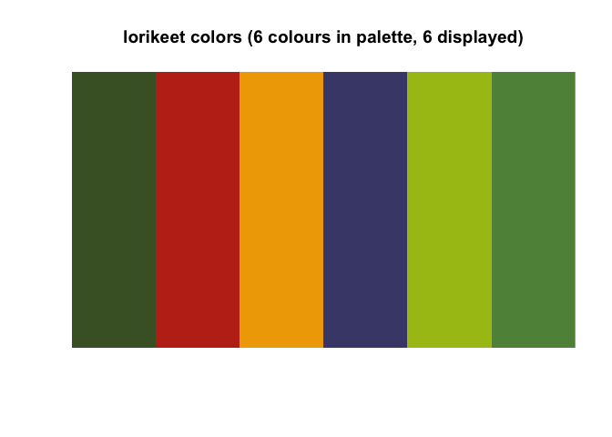
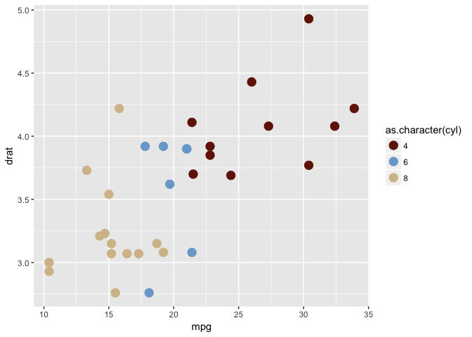
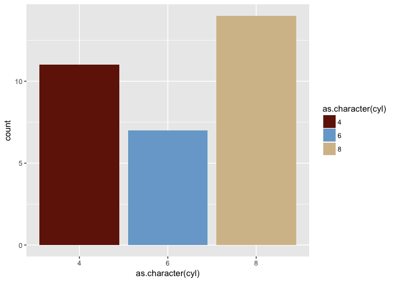
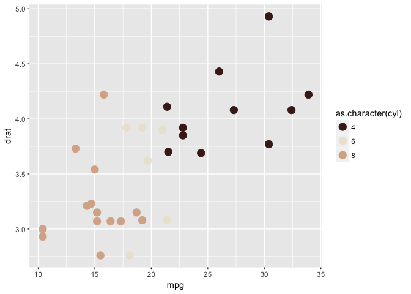
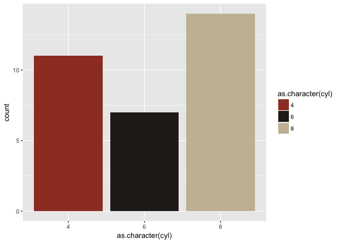
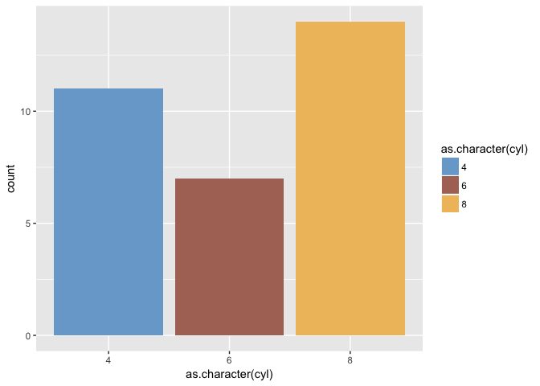

Create your own color palettes and apply them in `ggplot2` in a breeze. All you have to bring are the hex codes from you company or maybe derived from your favorite paintings? Based on the great work by the [ochRe team](https://github.com/ropenscilabs/ochRe).

Input is either a named `list` with palettes, or a single palette. (A palette is a character vector with hex codes of the colors.) Use `viz_pallette` to view all the colors in a palette

``` r
# devtools::install_github("edwinth/paletti")
library(paletti)
library(ggplot2)
```

    ## Warning: package 'ggplot2' was built under R version 3.2.5

``` r
viz_palette(ochre_palettes$lorikeet, "lorikeet colors")
```



From both a list of palettes and a single palette, you can create your own `scale_fill` and `scale_color` functions to be used in `ggplot2`. If these are based on a list of palettes, the functions will have an argument to select which of the palettes in the list to use.

``` r
# based on a single palette:
my_comp_fill <- get_scale_fill(get_pal(my_company_cols))
my_comp_col  <- get_scale_color(get_pal(my_company_cols))


ggplot(mtcars, aes(mpg, drat, col = as.character(cyl))) +
  geom_point(size = 4) +
  my_comp_col()
```



``` r
ggplot(mtcars, aes(as.character(cyl), fill = as.character(cyl))) +
  geom_bar() +
  my_comp_fill()
```



``` r
# based on a list of palettes:
dutchmasters_fill <- get_scale_fill(get_pal(dutchmasters))
dutchmasters_col  <- get_scale_color(get_pal(dutchmasters))

# scales based on lists default to the first palette
ggplot(mtcars, aes(mpg, drat, col = as.character(cyl))) +
  geom_point(size = 4) +
  dutchmasters_col()
```



``` r
ggplot(mtcars, aes(as.character(cyl), fill = as.character(cyl))) +
  geom_bar() +
  dutchmasters_fill("little_street")
```



The scales search for optimal contrast within the colors provided. The function `get_hex` creates a function that returns requested hex codes. It is created from a named palette. The returned function allows you to query with unquoted color names.

``` r
my_company_cols
```

    ##       red      blue    yellow 
    ## "#701B06" "#78A8D1" "#D5BF98"

``` r
mc_hex <- get_hex(my_company_cols)
mc_hex(yellow, blue, red)
```

    ## [1] "#D5BF98" "#78A8D1" "#701B06"

``` r
voD_hex <- get_hex(dutchmasters$view_of_Delft)
ggplot(mtcars, aes(as.character(cyl), fill = as.character(cyl))) +
  geom_bar()  +
  scale_fill_manual(values = voD_hex(
    blue(sky), red(roofs2), yellow(quay)
  ))
```


